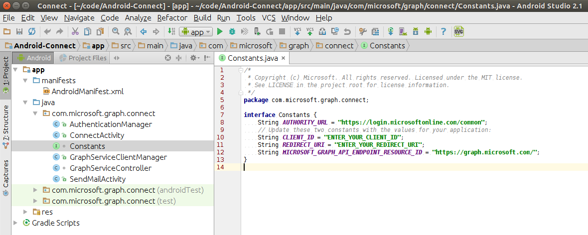

# 使用 Microsoft Graph SDK 的适用于 Android 的 Connect 示例

连接到 Office 365 是每个 Android 应用开始使用 Office 365 服务和数据必须采取的第一步。 该示例演示如何通过 Microsoft Graph SDK 连接并调用一个 API。

## 设备要求

要运行该 Connect 示例，您的设备需要满足以下要求：

* 800 x 480 或更大的屏幕尺寸。
* Android API 级别为 16 级或更高。
 
## 先决条件

若要使用适于 Android 的 Connect 示例，你需要以下各项：

* [Android Studio](http://developer.android.com/sdk/index.html) 版本 1.0 或更高。
* [Java 开发工具包 (JDK) 7](http://www.oracle.com/technetwork/java/javase/downloads/jdk7-downloads-1880260.html)。
* 在 Microsoft Azure 中注册的应用。 可以使用 [Office 365 应用注册工具](http://dev.office.com/app-registration)。 它简化了应用注册。 使用以下参数：

|     参数   |              值             |
|----------------:|:-------------------------------|
|        应用类型 | 本机应用                     |
|    重定向 URI | http://localhost:8000          |
| 应用权限 | Mail.Send                      |
  
  复制并存储“**客户端 ID**”和“**客户端密码**”值。
  
## 打开使用 Android Studio 的示例

1. 安装 [Android Studio](http://developer.android.com/sdk/index.html) 并根据 developer.android.com 上的[说明](http://developer.android.com/sdk/installing/adding-packages.html) 添加 Android SDK 包。
2. 下载或克隆该示例。
3. 启动 Android Studio。
    1. 关闭可能打开的任何项目，然后选择“**打开一个现有的 Android Studio 项目**”。
    2. 浏览你的本地存储库，然后选择 Android-Connect 项目。 单击“**确定**”。
    
    > 注意：如果你没有安装 **Android 支持存储库**，则 Android Studio 显示“**已检测到框架**”通知。 打开 SDK 管理器并添加 Android 支持存储库以避免已检测到框架的通知。
4. 打开 Constants.java 文件。
    1. 查找 CLIENT_ID 常数并将其字符串值设置为与你在 Azure Active Directory 中注册的客户端 ID 相等。
    2. 查找 REDIRECT_URI 常数并将其字符串值设置为与你在 Azure Active Directory 中注册的重定向 URI 相等。
    。

生成 Connect 示例后，你可以在仿真器或设备中运行。 在“**选择设备**”对话中选择配备了 API 级别为 16 级或更高级别的设备。

要了解有关该示例的详细信息，请参阅[在 Android 应用中调用 Microsoft Graph](https://graph.microsoft.io/en-us/docs/platform/android)。

## 参与 ##

如果想要参与本示例，请参阅 [CONTRIBUTING.MD](/CONTRIBUTING.md)。

此项目采用 [Microsoft 开源行为准则](https://opensource.microsoft.com/codeofconduct/)。有关详细信息，请参阅 [Code of Conduct FAQ](https://opensource.microsoft.com/codeofconduct/faq/)（行为准则常见问题解答），有任何其他问题或意见，也可联系 [opencode@microsoft.com](mailto:opencode@microsoft.com)。

## 问题和意见

我们乐意倾听你有关 Connect 示例的反馈。 你可以在该存储库中的 [问题](issues) 部分将问题和建议发送给我们。

与 Office 365 开发相关的问题一般应发布到[堆栈溢出](http://stackoverflow.com/questions/tagged/Office365+API)。确保您的问题或意见使用了 [Office365] 和 [API] 标记。

## 后续步骤

该示例只显示您的应用需要使用 Office 365 的必要程序。 应用可以使用 Office 365 API 进行的工作非常之多，例如，帮助用户使用日历管理工作日，在存储于 OneDrive 中的所有文件中查找用户需要的信息，或在他们的联系人列表中找出他们需要的人员。 在 [适用于 Android 的代码段示例](/OfficeDev/O365-Android-Microsoft-Graph-Snippets) 方面，我们还想与你分享更多的信息。 
  
## 其他资源

* [由 Microsoft Graph 提供支持的 Office 365 API 入门](http://dev.office.com/getting-started/office365apis)
* [Microsoft Graph 概述](http://graph.microsoft.io)
* [适用于 Android 的 Microsoft Graph SDK](../../../msgraph-sdk-android)
* [Office 365 Android Microsoft Graph 代码段](../../../../OfficeDev/O365-Android-Microsoft-Graph-Snippets)

## 版权
版权所有 (c) 2016 Microsoft。保留所有权利。